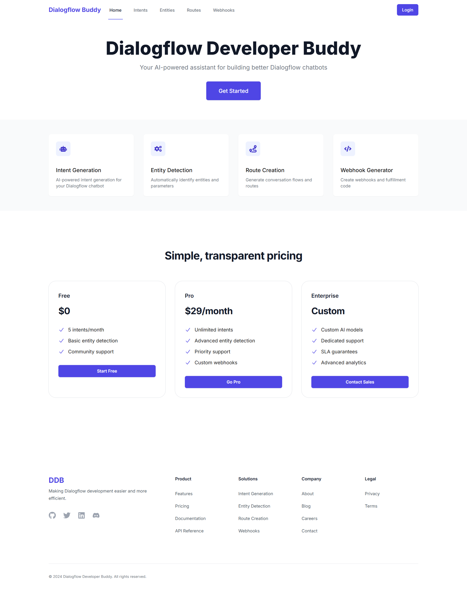
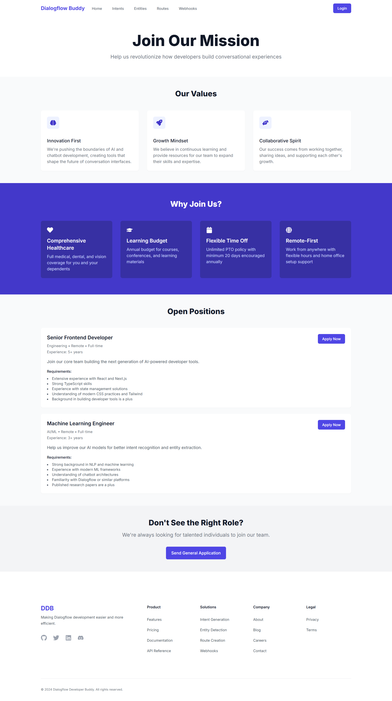
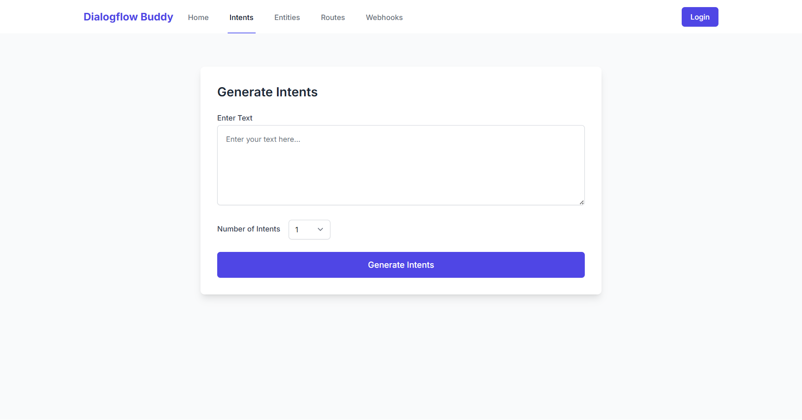
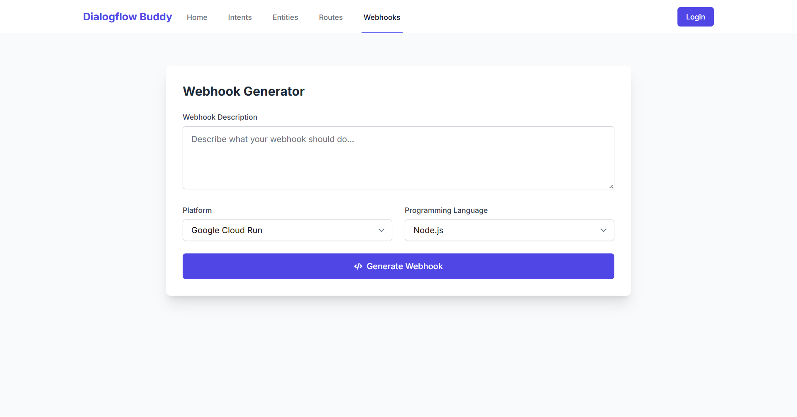

# Dialogflow SaaS








@Yash-Kavaiya


## Introduction

Dialogflow SaaS is a platform that enables developers to create, manage, and integrate conversational agents with ease.

## Features

- Seamless integration with various platforms
- Customizable conversational flows
- Analytics and reporting tools
- Multi-language support

## Installation

Clone the repository and install dependencies:

```bash
git clone https://github.com/yourusername/dialogflow-saas.git
cd dialogflow-saas
npm install
```

## Usage

Start the application:

```bash
npm start
```

Access the application at `http://localhost:3000`.

## Docker

To build and run the Docker container:

1. Build the Docker image:

```bash
docker build -t dialogflow-saas .
```

2. Run the Docker container:

```bash
docker run -p 3000:3000 dialogflow-saas
```

Access the application at `http://localhost:3000`.

## Screenshots


*Caption: Dashboard showcasing conversation analytics.*


*Caption: Illustration of Feature 1.*


*Caption: Illustration of Feature 2.*


*Caption: Settings page overview.*

## Documentation

For detailed information, refer to the [documentation](./docs/README.md).

## Contributing

Contributions are welcome. Please read the [contributing guidelines](./CONTRIBUTING.md) before submitting a pull request.

## License

This project is licensed under the MIT License.
